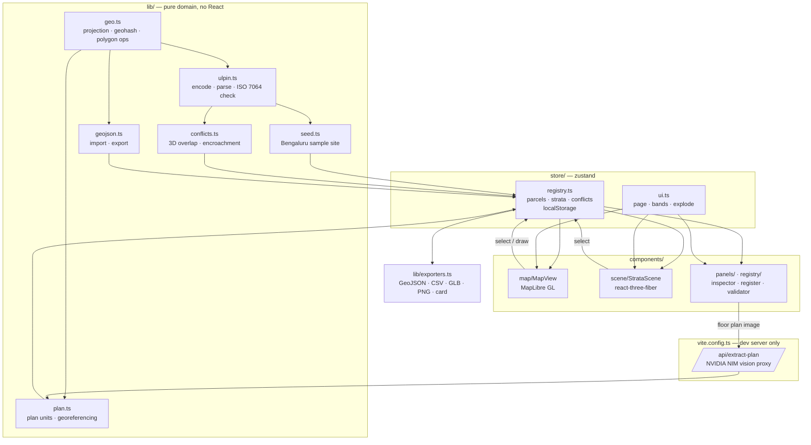

<div align="center">

# ULPIN 3D

### Unique land parcel identity for a city that grew upwards.

*Geocoded 3D ULPIN generation, vertical property mapping and stratified-title conflict detection — MapLibre · three.js · ISO 7064 MOD 37,36 · GeoJSON (CRS84)*


</div>

## What is ULPIN 3D?

Conventional land records identify a *surface* parcel. They cannot say who owns the 3.2 m of air between 23.7 m and 26.9 m above that parcel, which is where an apartment actually exists. The same gap swallows basement parking, metro viaducts, subsurface utility corridors, rooftop solar rights and transferable development rights — all of which are bought, sold, mortgaged and litigated as if they were land, while the register describes only the ground beneath them.

ULPIN 3D treats the surface parcel as a root identity and issues every legally distinct **volume** above and below it its own identifier. A volume is a footprint polygon plus an elevation range, a use class, a tenure type and a right holder. Because identity is generated from geometry, two claims to the same cubic metres are detectable arithmetically rather than by reading deeds.

Three ways in:

- **Map** — real OpenStreetMap basemap, surveyed parcels as cadastral polygons, strata extruded at true elevation; draw a new parcel and it is assigned a base ULPIN on the spot.
- **Model** — an analytic 3D view of one parcel's stack, explodable floor-by-floor, colour-coded by use or tenure, with conflicting volumes outlined in red.
- **Registry** — a searchable register of every volume, plus an offline validator that verifies any 3D ULPIN's check character and recovers its parcel centroid from the identifier alone.

> The identifier is not a database key. The 14-character root encodes the parcel centroid to ~15 cm as a geohash, and the vertical extension encodes the band, level and unit — so a 3D ULPIN can be validated and geographically located with no network, no lookup and no registry access.

## Features

### Identity generation

- **Geocoded base ULPIN** — 14 characters: 2-digit LGD state code + 11-character geohash of the parcel centroid + ISO 7064 MOD 37,36 check character.
- **Vertical extension** — appends band, level and unit to the surface root, keeping the existing parcel identity intact and human-readable.
- **Self-validating** — single-character corruption and adjacent transposition are both caught by the check character; validation needs no registry.
- **Reversible geocode** — `baseCentroid()` decodes the embedded geohash back to a coordinate, so an identifier alone locates its parcel.

### Vertical property mapping

- **Volumetric parcels** — every stratum carries a footprint ring, `zMin`/`zMax` relative to a ground datum in m MSL, carpet and built-up area.
- **Six vertical bands** — subsurface, basement, ground, floor, airspace and elevated corridor, each independently visible.
- **True-elevation rendering** — the same volumes drawn as extruded footprints on the map and as an explodable stack in the 3D model view.
- **Tenure-aware** — freehold, leasehold, easement, air rights, government and common holdings are distinct classes, not a text field.

### Plan digitisation (AI)

- **Floor plan → vertical parcels** — drop a floor-plan image; a vision model returns every separately owned space on the floor (flats, shops, lift cores, service rooms, parking bays) as metric rectangles.
- **Georeferencing** — extracted spaces are scaled to fit the parcel, rotated to the building's true orientation and converted to lat/long footprints, so a drawing becomes cadastral geometry.
- **Multi-storey replication** — digitise one typical floor and stamp it across N storeys; each unit on each floor receives its own 3D ULPIN.
- **Topology validation on import** — units that fall outside the parcel are counted before you commit, and anything that still overlaps is caught by the conflict engine afterwards.
- **Runs without a key** — a built-in sample plan exercises placement, replication and identifier generation when no vision engine is configured.

### Conflict detection

- **3D overlap** — two volumes conflict only when their footprints intersect *and* their elevation ranges overlap; the overlap area is measured, not guessed.
- **Tenure-sensitive severity** — two exclusive claims to the same cubic metres are critical; an easement crossing a freehold volume is a servitude to be recorded, not an error.
- **Encroachment** — a volume extending beyond its parent parcel's surface boundary is flagged.
- **Register integrity** — duplicate identifiers, failed check characters and inverted extents are all surfaced.

### Interchange

| Export | Format | Contents |
|---|---|---|
| GeoJSON | `application/geo+json`, CRS84 | Parcels and strata as polygons; strata carry `z_min`, `z_max`, tenure, holder, encumbrance |
| CSV | `text/csv` | One row per registered volume, 16 columns, for spreadsheet-based registers |
| GLB | `model/gltf-binary` | The strata stack as a 3D model for Blender, CesiumJS or a viewer |
| PNG | `image/png` | 2× render of the 3D view |
| Property card | Standalone HTML | Printable per-volume record with the full ULPIN breakdown, extents and recorded conflicts |

Import accepts any GeoJSON `FeatureCollection`. Polygon features become parcels and are assigned a base ULPIN; features carrying `ulpin`, `z_min` or `feature_kind: "stratum"` are registered as volumes under whichever parcel contains their centroid.

## Architecture



| Component | Role | Backed by |
|---|---|---|
| `lib/ulpin.ts` | Identifier generation, parsing, check characters | ISO 7064 MOD 37,36, geohash base-32 |
| `lib/geo.ts` | Local ENU projection, areas, centroids, polygon intersection | Equirectangular projection about a local origin |
| `lib/conflicts.ts` | Volumetric conflict rules and severity | Footprint intersection × elevation overlap |
| `lib/plan.ts` | Floor-plan units → georeferenced volumes, scale/rotation fitting | Pure geometry; model output is normalised and clamped |
| `store/registry.ts` | Single source of truth; recomputes conflicts on every write | zustand + `localStorage` |
| `components/map/MapView.tsx` | Basemap, cadastral polygons, `fill-extrusion` strata, polygon drawing | MapLibre GL 6 + OpenStreetMap raster tiles |
| `components/scene/StrataScene.tsx` | Extruded legal volumes, selection, explode, GLB registry | three.js `ExtrudeGeometry` via react-three-fiber |

## ULPIN anatomy

`29TDR1V9QTJ1XH-F07-002-1`

| Segment | Example | Width | Meaning |
|---|---|---|---|
| State | `29` | 2 | LGD state code (29 = Karnataka) |
| Geocode | `TDR1V9QTJ1X` | 11 | Geohash of the parcel centroid, ≈15 cm resolution |
| Root check | `H` | 1 | ISO 7064 MOD 37,36 over the 13 preceding characters |
| Level | `F07` | 3 | Band letter + two-digit level |
| Unit | `002` | 3 | Base-36 unit within that level |
| Check | `1` | 1 | ISO 7064 MOD 37,36 over the whole identifier |

| Band | Code | Covers |
|---|---|---|
| Subsurface | `S` | Utility corridors, water mains, cable ducts below basement level |
| Basement | `B` | Basement parking and plant levels, numbered downwards |
| Ground | `G` | Surface-level retail, concourse, carriageway |
| Floor | `F` | Habitable and commercial storeys, numbered upwards |
| Airspace | `A` | Air rights, TDR columns, rooftop solar rights |
| Elevated | `E` | Viaducts, skywalks and elevated corridors crossing the parcel |

## Conflict rules

| Rule | Trigger | Severity |
|---|---|---|
| `volume-overlap` | Footprints intersect (> 0.5 m²) and elevation ranges overlap (> 1 cm), both tenures exclusive | critical |
| `volume-overlap` | Same geometric test, but one side is an easement or common holding | warning — record as servitude |
| `outside-parcel` | A stratum footprint vertex falls outside its parent parcel boundary | critical |
| `duplicate-ulpin` | Two volumes share an identifier | critical |
| `invalid-ulpin` | Check character fails validation | critical |
| `inverted-extent` | `zMax ≤ zMin` | warning |

Exclusive tenures are freehold, leasehold, government and air rights. Easement and common holdings are expected to overlap and are recorded as servitudes.

## Project structure

```
src/
  types.ts                      # Parcel, Stratum, Conflict, UlpinParts
  lib/
    geo.ts                      # projection, geohash, centroid, area, intersection
    ulpin.ts                    # base + vertical ULPIN, ISO 7064 check characters
    conflicts.ts                # volumetric conflict detection
    geojson.ts                  # GeoJSON import / export
    exporters.ts                # GeoJSON, CSV, GLB, PNG, property card
    palette.ts                  # use / tenure / band colours
    plan.ts                     # floor-plan units, georeferencing, extraction prompt
    seed.ts                     # sample site: tower, metro corridor, tech park
  store/
    registry.ts                 # parcels, strata, derived conflicts, persistence
    ui.ts                       # page, workspace mode, band filters, explode, toasts
  components/
    TopBar.tsx                  # mode switching, survey, import, export menu
    modals.tsx                  # import, new volume, property card, toast
    PlanImportModal.tsx         # floor-plan digitisation: extract, place, replicate
    icons.tsx                   # inline SVG icon set
    map/MapView.tsx             # MapLibre basemap, parcels, extrusions, drawing
    scene/Viewport3D.tsx        # canvas, lighting, camera framing, snapshots
    scene/StrataScene.tsx       # extruded volumes, selection, explode, labels
    panels/ParcelPanel.tsx      # parcel list, band filters, strata stack
    panels/InspectorPanel.tsx   # ULPIN card, attributes, conflicts, actions
    registry/RegistryPage.tsx   # register table, search, offline validator
```

## Setup

```bash
npm install
npm run dev        # http://localhost:5180
npm run build      # type-check + production bundle
npm run preview    # serve the production build
```

Identifier generation, conflict detection, the registry and every export work with no configuration at all. Two optional variables enable AI plan digitisation:

| Variable | Required for | Notes |
|---|---|---|
| `NVIDIA_API_KEY` | Floor-plan extraction | Read by the **dev server only** and never sent to the browser. Without it the modal says so and the sample plan still works. |
| `NVIDIA_BASE_URL` | Testing / alternate endpoints | Defaults to `https://integrate.api.nvidia.com/v1`. |

Set the key in a gitignored `.env` (`.env` is already ignored) or export it before `npm run dev`. Extraction is proxied through the Vite dev server at `/api/extract-plan` so the key stays server-side — which also means **plan extraction is unavailable in `npm run preview` and in a static production deploy**; that path would need a real backend or serverless function.

The basemap uses OpenStreetMap raster tiles directly, so the map needs network access.

`vite.config.ts` excludes `maplibre-gl` from Vite's dependency pre-bundling. This is required: the pre-bundled worker never completes GeoJSON source loads, which silently leaves the map empty.

## Data & trust

- The registry is held in the browser's `localStorage` under `ulpin3d.registry.v2`. Nothing is transmitted to a server; there is no backend.
- The sample dataset is fictional. Parcels, holders, survey numbers and the pending suit are invented and placed over a real Bengaluru location for demonstration.
- Generated identifiers follow the documented scheme in this repository. They are structurally compatible with a 14-character surface ULPIN but are **not** issued under, or verified against, any government register, and the exported property card is not a legal instrument.

## Status

| Area | State | How it was checked |
|---|---|---|
| ULPIN encode / decode / validation | Verified | 17 assertions: determinism, corruption and transposition detection, centroid recovery within 1 m, collision-free across 328 identifiers |
| Geometry (area, centroid, intersection) | Verified | Assertions against known rectangles; centroid precision fix confirmed for 4 × 9 m footprints |
| Conflict detection | Verified | Runs against the sample registry: 1 critical title dispute, 2 servitude warnings, no false positives |
| GeoJSON round-trip | Verified | Export → re-import reproduces 3 parcels and all 44 volumes with no losses or malformed identifiers |
| Map, 3D view, panels, registry | Verified | Headless-browser runs against dev and production builds: no console errors, strata render in both views, selection and explode behave |
| Parcel drawing, property card, exports | Verified | Driven in a headless browser: drawn parcel received a valid base ULPIN; card and GeoJSON download correctly |
| Plan georeferencing | Verified | 11 assertions: areas match the plan within 0.01%, rotation preserves area, units never overlap, oversized plans are flagged, malformed model output is dropped |
| Plan extraction pipeline | Verified against a mock | Full browser run through a stand-in OpenAI-compatible endpoint: fenced JSON, `reasoning_content`-only and non-JSON replies all handled; 3 units × 3 floors registered with unique ULPINs |
| Building extraction from imagery | Run, low accuracy | SAM vit_b over Esri World Imagery tiles via `services/vision`, run through the pipeline on Bengaluru, Mumbai and Delhi boxes. Against uncapped OSM in a 0.004° Bengaluru box: 65% of detections inside a mapped building, 44% of mapped buildings covered, 23% matched at IoU 0.5, matched IoU 0.65. Mumbai and Delhi have too little OSM to score, and footprints there were only inspected by eye. A gpt-4o crop check raised detections inside a mapped building from 65% to 79% but cut mapped-building coverage from 44% to 28% (one box). Tile licence may forbid extraction use |
| Live NVIDIA NIM vision call | **Not verified** | No API key was available in this environment. The request shape (model, text + `image_url` parts, auth header) was confirmed on the wire against a mock, but `moonshotai/kimi-k2.6` has never actually been called, and real floor-plan extraction quality is unmeasured |
| Cross-browser / mobile | Not verified | Only Chromium at desktop widths has been exercised |
| Scale beyond the sample dataset | Not verified | Conflict detection is O(n²) over volumes; untested above ~90 volumes |
| Accessibility | Not verified | No keyboard-navigation or screen-reader audit has been done |

## License

No licence file is committed to this repository yet.

<div align="center">
<sub>Built with <a href="https://maplibre.org/">MapLibre GL JS</a> · <a href="https://threejs.org/">three.js</a> · <a href="https://r3f.docs.pmnd.rs/">React Three Fiber</a> · <a href="https://zustand.docs.pmnd.rs/">zustand</a> · <a href="https://vite.dev/">Vite</a> · basemap © <a href="https://www.openstreetmap.org/copyright">OpenStreetMap</a> contributors</sub>
</div>
