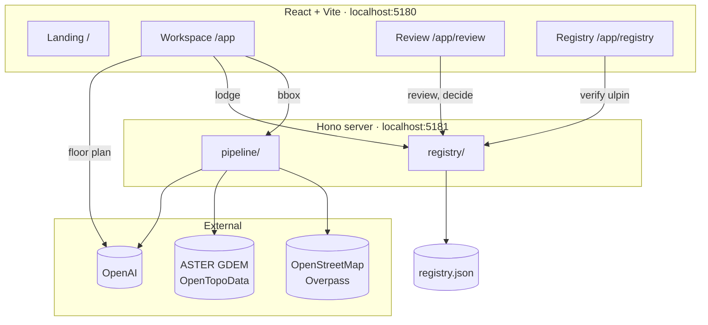

# Architecture

## Shape

Three deployables: a React workspace, a Node feed/register server, and the map/terrain/model
services it calls out to.



## The pipeline

`server/src/pipeline/` — each stage is a separate module so a stage can be swapped or moved to a
Python worker without restructuring.

```
sources/osmBuildings.ts   Overpass query, mirror fallback, cache, retry
sources/terrain.ts        Terrain sampling for a ground datum
derive/volumes.ts         Storey count + height -> one volume per level, plus basements
validate/topology.ts      Eight ISO-19107-style checks
ai/openai.ts              OpenAI client
ai/units.ts               Per-level classification, run in parallel
run.ts                    Orchestration, bbox widening
```

Order: **target → ingest → derive → validate → identify → lodge → publish.** `validate` is a gate:
a target with critical findings never reaches `identify`.

### Validation checks

| Code | Severity | Catches |
| --- | --- | --- |
| `datum-undeclared` | critical | Elevations with no vertical reference |
| `ring-degenerate` | critical | Fewer than three distinct corners, or zero area |
| `ring-self-intersection` | critical | Boundary crosses itself — solid not watertight |
| `inverted-extent` | critical | Ceiling at or below floor |
| `vertical-gap` | critical | Unassigned space between stacked volumes |
| `volume-overlap` | critical | Two volumes occupying the same space |
| `envelope-mismatch` | warning | Stack height disagrees with the building envelope |
| `implausible-storey` | warning | Storey outside 2.6–4.2 m |
| `height-assumed` | warning | No storey count or height in the source |
| `registered-volume-conflict` | critical | Overlaps a volume already on the register |

## The register

`server/src/registry/` — file-backed shared state, so a submission outlives one browser.

State machine: `draft → submitted → under_review → approved | objected | rejected`.

| Route | Role | Purpose |
| --- | --- | --- |
| `POST /api/registry/submissions` | surveyor | Lodge |
| `GET /api/registry/submissions` | officer | Queue |
| `POST /api/registry/submissions/:id/claim` | officer | Open for review |
| `POST /api/registry/submissions/:id/decide` | officer | Approve / object / reject |
| `GET /api/registry/records` | any | Registered volumes |
| `GET /api/registry/verify/:ulpin` | public | Existence, registration, encumbrance — **no holder** |

Approval is refused if validation has unresolved criticals, or if any volume conflicts with the
existing register. Every transition appends to an audit trail.

## Identifier scheme

```
29TDR1V9QTJ1XH - F07 - 002 - M
└─ root ─────┘   │     │     └─ check character
                 │     └─ unit
                 └─ band + level
```

Root = 2-digit LGD state code + 11-character geohash of the parcel centroid + ISO 7064 MOD 37,36
check character. Bands: `S` subsurface, `B` basement, `G` ground, `F` floor, `A` airspace,
`E` elevated.

`validateBase()` verifies the check character offline; `baseCentroid()` decodes the geohash back to
a coordinate. Neither needs a network or a database. A `declared` root — one imported from an
external record — is exempted from both, because our derivation is not the official one.

## Interoperability

CityJSON 2.0 export (`src/lib/cityjson.ts`): parcels as `LandUse`, a `Building` per parcel with a
`BuildingUnit` child per volume carrying a `Solid` geometry, EPSG:4979, quantised vertices.

Verified with `cjio` (`LandUse (1) → Building (1) → BuildingUnit (3)`, bbox 913 → 922.6 m) and
validated against the official CityJSON JSON Schema with **zero errors**.

## Stack

React 18 · MapLibre GL · three.js / react-three-fiber · Zustand · Tailwind v4 · Vite —
Hono · Node 22 · SSE — OpenAI `gpt-4o` (vision) and `gpt-4o-mini` (classification).

## Known limitations

- The floor-plan route runs inside the Vite dev server, so extraction does not work under
  `preview` or a static deploy.
- Roles are sent as an `x-ulpin-role` header. This is a demonstration switch, not authentication.
- The workspace registry is per-browser `localStorage`; only the lodgement register is shared.
